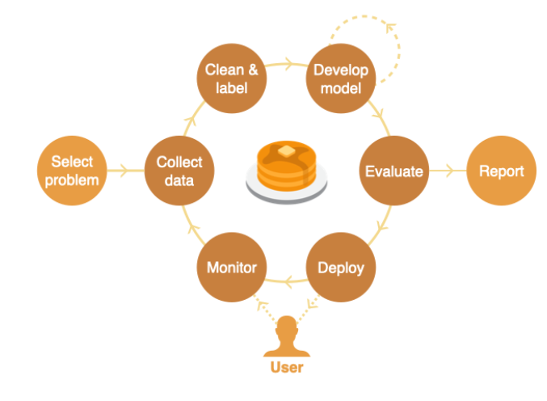

# Full Stack Deep Learning

The Full Stack brings people together to learn and share best practices across the entire lifecycle of an AI-powered product: from defining the problem and picking a GPU or foundation model to production deployment and continual learning to user experience design.

**Course:** [Full Stack Deep Learning 2022](https://fullstackdeeplearning.com/course/2022/)

| Week | Lecture | Resources | Note | Completion |
| :--: | :--- | :--: | :--: | :--: |
| 1 | Pre-Labs: CNNs, Transformers, PyTorch Lightning| [Lab](https://fullstackdeeplearning.com/course/2022/labs-1-3-cnns-transformers-pytorch-lightning/) | Note | &#x2610; |
| 2 | Course Vision and When to Use ML |  |  |  |
| 3 | Development Infrastructure & Tooling |  |  |  |
| 4 | Troubleshooting & Testing |  |  |  |
| 5 | Data Management |  |  |  |
| 6 | Deployment |  |  |  |
| 7 | Continual Learning |  |  |  |
| 8 | Foundation Models |  |  |  |
| 9 | ML Teams and Project Management |  |  |  |
| 10 | Ethics |  |  |  |
| 11 | Project Presentation |  |  |  |
 
 **Course:** [LLM Bootcamp](https://fullstackdeeplearning.com/llm-bootcamp/spring-2023/) - Spring 2023
 
| S.N | Lectures | Resources | Completion |
| :--: | ---- | ---- | ---- |
| 1 | Learn to Spell |  |  |
| 2 | LLMOps |  |  |
| 3 | UX for Language User Interfaces |  |  |
| 4 | Augmented Language Models |  |  |
| 5 | Launch an LLM App in One Hour |  |  |
| 6 | LLM Foundations |  |  |
| 7 | Project Walkthrough |  |  |
| 8 | What's Next? |  |  |